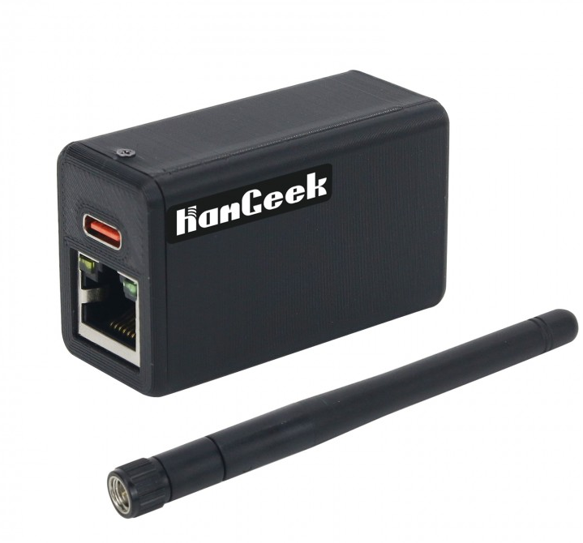
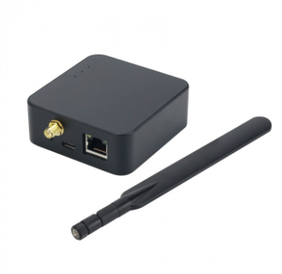

# Zigbee-Gateways

## Zigbee网关集合
| 图片 | 设备 | 描述 | 工作模式 | 教程 |
| ---- | ---- | ---- | ---- | ---- |
|  | [Zigbee USB Gateway](https://www.aliexpress.us/item/3256803441836847.html) | CC2652P2 | USB | [教程](wiki/Zigbee-Gateway-USB.md)  \/ [Tutorial](https://docs.google.com/document/d/1SMBQe_rETFeiTMvBTStlJ_jJLYbEvRIU/edit?usp=share_link&ouid=117637034512906927756&rtpof=true&sd=true) |
|  | [Zigbee LAN Gateway](https://www.aliexpress.us/item/3256804554006317.html) | CC2652P2 & LAN Modbus | USB/LAN| [教程](wiki/Zigbee-Gateway-LAN.md) \/ [Tutorial](https://docs.google.com/document/d/13qe-V-9nVCkFFYsOu7YKa58MLR82wJHC/edit?usp=share_link&ouid=117637034512906927756&rtpof=true&sd=true)  |
|  | [Zigbee LAN Gateway PRO](https://www.aliexpress.us/item/3256804557892073.html) [Zigbee POE Gateway PRO](https://www.aliexpress.us/item/3256804675805140.html) | CC2652P2 & ESP32 Module | USB/LAN/POE | [教程](wiki/Zigbee-Gateway-LAN-PRO.md)  \/ [Tutorial](https://docs.google.com/document/d/1jTb5zv91QcaXOcuIfqH5Ss0eCGM6MlBZ/edit?usp=share_link&ouid=117637034512906927756&rtpof=true&sd=true) |